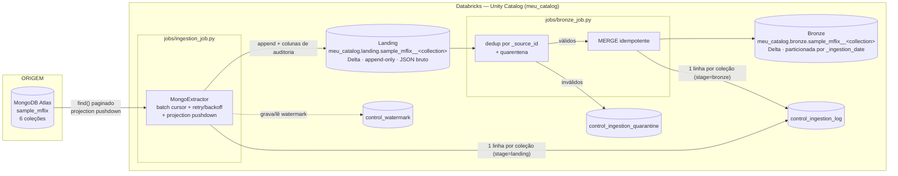

# Arquitetura — Ingestão sample_mflix

## Fluxo implementado



Duas tasks encadeadas (`ingestion_job` → `bronze_job`, dependência declarada
via `depends_on` / `taskValues`, ver `config/databricks_job.yml`) — não por
horário fixo, seguindo o princípio de dependência explícita (Aula 5, 5.0).

---

## Camadas

### Landing
- Tabela Delta: `meu_catalog.landing.sample_mflix__<collection>`
- Append-only, dado bruto: `_source_id` (string do `_id` do Mongo) + `body`
  (documento inteiro serializado em JSON) + colunas de auditoria (R4).
- Particionada por `_ingestion_date`.
- Um arquivo por lote de `batch_size` documentos, com `repartition()`
  calculado a partir do volume (evita small files e skew — R2).

### Bronze
- Tabela Delta: `meu_catalog.bronze.sample_mflix__<collection>`
- Mesma representação genérica (`_source_id` + `body` + colunas de
  auditoria), consolidada a partir da Landing via `MERGE INTO ... ON
  t._source_id = s._source_id` — idempotente por construção (R3): reexecutar
  o mesmo `_ingestion_id` não duplica linha.
- Particionada por `_ingestion_date`.
- Colunas de rastreabilidade obrigatórias presentes em 100% das linhas (R4).

### Control
- `meu_catalog.bronze.control_ingestion_log` — uma linha por coleção por
  estágio (`landing` e `bronze`) por execução (R5).
- `meu_catalog.bronze.control_watermark` — histórico append-only de
  watermarks; a pipeline sempre lê o valor mais recente por coleção (R3).
- `meu_catalog.bronze.control_ingestion_quarantine` — documentos que não
  puderam ser identificados (sem `_source_id`/`body`) — nunca descartados
  silenciosamente (R7).

---

## Decisões técnicas

**Formato dos arquivos:**
```
Decisão: Delta Lake em todas as camadas (Landing e Bronze).
Justificativa: ACID em escritas concorrentes, MERGE nativo (essencial
para idempotência), schema enforcement/evolution controlados e
DESCRIBE HISTORY para auditoria — conforme Aula 2 (2.4).
```

**Representação do dado na Landing/Bronze:**
```
Decisão: cada documento MongoDB vira UMA linha (_source_id, body JSON) +
colunas de controle. Nenhum StructType por coleção é declarado nesta
camada.
Justificativa: é a única forma de atender R1 com um único código genérico
para as 6 coleções, que têm schemas completamente diferentes entre si.
Também elimina o risco de schema drift na Bronze descrito na Aula 4
(inferência instável, denominador comum "string") — o corpo do documento
nunca é coagido a um tipo. A tipagem explícita (ex.: schema_movies) fica
para a camada Silver (fora do escopo obrigatório), onde try_cast torna
falhas de conversão uma métrica visível, não um null silencioso.
```

**Trigger do job Bronze:**
```
Decisão: scheduled (cron diário) + dependência explícita da task anterior
(run_if = ALL_SUCCESS), não por horário fixo entre jobs separados.
Justificativa: dependência por horário quebra no primeiro dia atípico
(Aula 5, Era 1). O bronze_job só roda depois que ingestion_job termina
com sucesso, usando o DAG do próprio Databricks Job.
```

**Estratégia de idempotência na Bronze:**
```
Decisão: MERGE INTO por _source_id (upsert), com dedup prévio via
row_number() sobre janela particionada por _source_id, ordenada por
_ingestion_timestamp desc.
Justificativa: rodar a mesma execução (mesmo _ingestion_id) duas vezes
não duplica nem corrompe a Bronze — a chave técnica (_source_id) nunca
muda entre execuções. A Landing continua append-only e acumula histórico
bruto (fonte de verdade para reprocessar a Bronze do zero, se necessário),
enquanto o MERGE garante que a camada analítica nunca duplica.
```

**Tratamento de schema drift:**
```
Decisão: persistência do documento como JSON/string bruta + colunas de
controle (opção 2 do R7), em vez de schema evolution explícito por
coleção.
Justificativa: MongoDB é schemless por natureza (Aula 4) — campos somem,
mudam de tipo (ex.: movies.year é int em 21.329 docs e string em 20) ou
aparecem em apenas parte dos documentos. Declarar um StructType por
coleção quebraria R1 (código genérico) e obrigaria a manter 6 schemas
sincronizados manualmente. Guardando o corpo como string, a Bronze nunca
falha por incompatibilidade de tipo — a tipagem fica para o consumo
(Silver), com try_cast e métricas de falha explícitas.
```

**Registros inválidos (R7):**
```
Decisão: documentos sem _source_id ou sem body (falha ao serializar) vão
para meu_catalog.bronze.control_ingestion_quarantine com motivo e
timestamp — nunca são descartados silenciosamente.
```

**Limiar de reconciliação (R8):**
```
Decisão: max_divergence_pct = 1.0% (config/pipeline_config.yaml).
Acima disso, o stage bronze da execução é marcado PARTIAL no
control_ingestion_log, com a mensagem de erro detalhando divergência,
% de nulos de chave e duplicados encontrados no lote.
```

**Nomenclatura de catálogo/schema/tabela:**
```
<catalog>.<landing|bronze>.sample_mflix__<collection>
Ex.: meu_catalog.bronze.sample_mflix__movies
Prefixo sample_mflix__ deixa explícito, só pelo nome da tabela, de qual
banco de origem o dado veio — útil quando o catálogo passar a receber
outras fontes no futuro.
```

**Modos de carga por coleção:**

| Coleção | Modo | Watermark field | Justificativa |
|---|---|---|---|
| movies | incremental | `lastupdated` (string) | ~21k docs; comparação lexicográfica válida no formato `YYYY-MM-DD HH:MM:SS.nnnnnnnnn` |
| comments | incremental | `date` (ISODate) | maior volume (~50k); ISODate nativo, watermark direta e confiável |
| users | full | — | pequena (~185) e estável; `password` excluído via projection pushdown |
| theaters | full | — | pequena (~1.500) e estável; GeoJSON preservado como veio |
| sessions | full | — | poucos/zero docs; pipeline tolera `count = 0` sem falhar; `jwt` excluído |
| embedded_movies | full | — | `plot_embedding` (~1536 floats/doc) excluído via projection pushdown por custo de memória |

---

## Boas práticas de uso de recursos (R2) — mapeamento

| Técnica exigida | Onde está implementada |
|---|---|
| Leitura paginada / batch | `extractor.extract_batches` — cursor com `batch_size`, nunca materializa a coleção inteira |
| Projection pushdown | `CollectionConfig.projection()` — `password`, `jwt`, `plot_embedding`, `fullplot`, `poster` nunca trafegam da origem |
| Controle de paralelismo/partições | `landing_writer.write_landing` — `repartition()` calculado por volume (`target_rows_per_partition`) |
| Ausência de `collect()`/`toPandas()`/`list(cursor)` total | `extract_batches` só materializa `itertools.islice(cursor, batch_size)` por vez (≤5.000 docs), nunca a coleção inteira |
| Reuso de conexão | `MongoConnector` instanciado uma vez por execução, reutilizado nas 6 coleções (`jobs/ingestion_job.py::run`) |
| Retry com backoff | `mongo_connector.with_retry` — backoff exponencial (2s, 4s, 8s) em `AutoReconnect`/`NetworkTimeout` |
